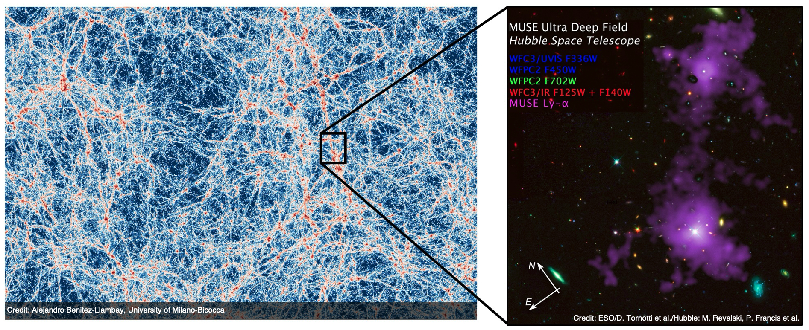

Welcome! I'm a third-year PhD student in astrophysics at the University of Milano-Bicocca in Italy.

My research explores the **filamentary structure of the Cosmic Web** — the large-scale network that forms the backbone of our Universe — and how galaxies evolve within these environments across cosmic time. I combine **observational data** from state-of-the-art facilities such as VLT/MUSE with **cosmological simulations**.

Beyond astrophysics, I love mountains — climbing, hiking, and alpinism — and I'm an active member of the **Italian Alpine Club**, where I am also a climbing instructor.

  

