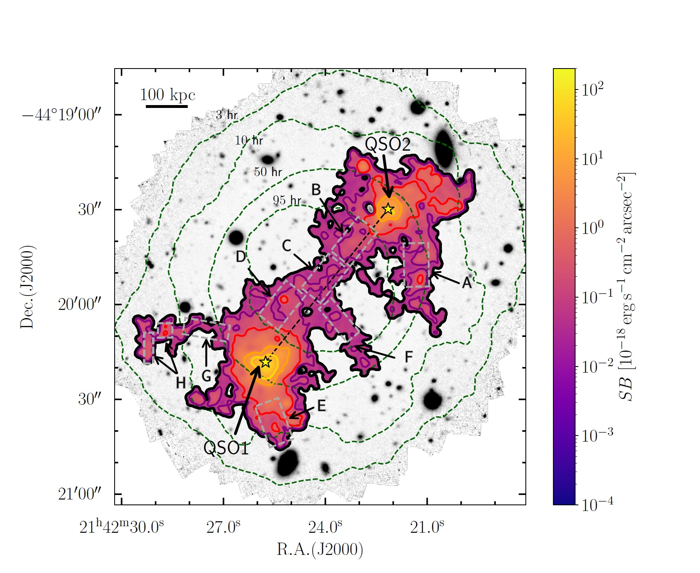
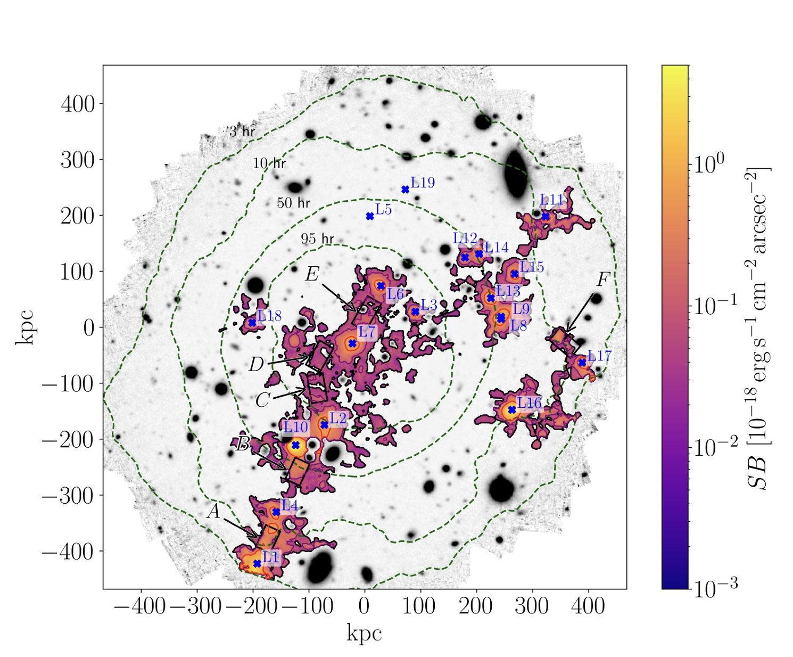
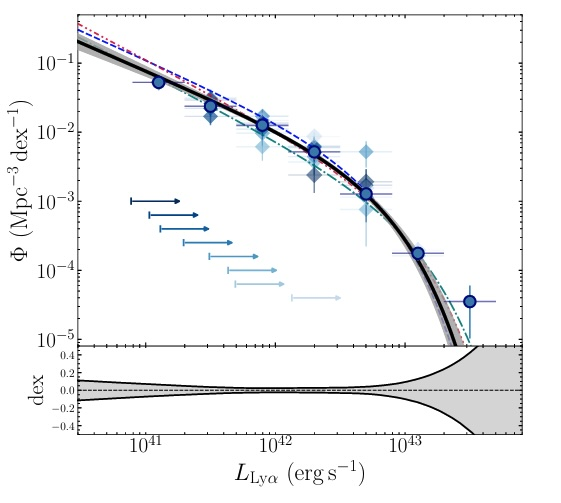

```{=html}
<aside class="left-sidebar">
  <div class="sidebar-content">
    
    <h2 class="sidebar-name">Davide Tornotti</h2>
    <p class="sidebar-title">Third-year PhD Student</p>
    <div class="sidebar-info">
      <div class="info-item"><i class="fas fa-map-pin" style="font-size: 16px; min-width: 20px;"></i><span>Milan, Italy</span></div>
      <div class="info-item"><i class="fas fa-university" style="font-size: 16px; min-width: 20px;"></i><span>University of Milano-Bicocca</span></div>
      <div class="info-item"><i class="fas fa-envelope" style="font-size: 16px; min-width: 20px;"></i><a href="mailto:d.tornotti@campus.unimib.it">d.tornotti@campus.unimib.it</a></div>
      <div class="info-item"><i class="fab fa-orcid" style="font-size: 16px; min-width: 20px;"></i><a href="https://orcid.org/0009-0001-3388-8742" target="_blank">ORCID</a></div>
      <div class="info-item"><i class="fab fa-linkedin" style="font-size: 16px; min-width: 20px;"></i><a href="https://linkedin.com/in/davide-tornotti-8a20981b9" target="_blank">LinkedIn</a></div>
    </div>
  </div>
</aside>
```

## First-Author Publications

```{=html}
<div id="papers-list" style="display: grid; gap: 30px; margin-bottom: 60px;">
  <!-- Paper 1 -->
  <div style="display: grid; grid-template-columns: 300px 1fr; gap: 30px; align-items: start; padding: 20px; border: 1px solid #e0e0e0; border-radius: 8px; background-color: #fafafa;">
    
    <div>
      <h3 style="margin-top: 0;">High-definition imaging of a filamentary connection between a close quasar pair at z=3</h3>
      <p style="color: #666; font-size: 14px; margin: 10px 0;">Tornotti et al. 2025a - Nature Astronomy</p>
      <p></p>
      <p>
        <a href="https://arxiv.org/abs/2406.17035" style="color: #007bff; text-decoration: none; font-weight: bold;">Read on arXiv →</a> | 
        <a href="https://www.nature.com/articles/s41550-024-02463-w" style="color: #007bff; text-decoration: none; font-weight: bold;">Published →</a>
      </p>
      
      <!-- Media Coverage -->
      <details style="margin-top: 15px; padding: 12px; background-color: white; border: 1px solid #ddd; border-radius: 4px; cursor: pointer;">
        <summary style="font-weight: bold; color: #333;"> Media Coverage</summary>
        <div style="margin-top: 12px; padding-top: 12px; border-top: 1px solid #eee;">
          <div style="margin-bottom: 15px;">
            <p style="font-weight: bold; color: #333; margin-bottom: 8px;">English</p>
            <ul style="list-style: none; padding: 0; margin: 0;">
              <li style="margin-bottom: 6px;"><a href="https://www.nature.com/natastron/volumes/9/issues/4" style="color: #007bff; text-decoration: none;">Cover of Nature Astronomy  </a> 
              <li style="margin-bottom: 6px;"><a href="https://www.eso.org/public/images/potw2504a/" style="color: #007bff; text-decoration: none;">European Southern Observatory</a> 
              <li style="margin-bottom: 6px;"><a href="https://www.mpa-garching.mpg.de/1109034/news20250129" style="color: #007bff; text-decoration: none;">Max Planck Institute for Astrophysics</a> 
            </ul>
            </ul>
          </div>
          <div>
            <p style="font-weight: bold; color: #333; margin-bottom: 8px;">Italian</p>
            <ul style="list-style: none; padding: 0; margin: 0;">
              <li style="margin-bottom: 6px;"><a href="https://www.unimib.it/news/ragnatela-cosmica-della-materia-oscura-che-forma-luniverso-fotografata-ricercatori-milano-bicocca" style="color: #007bff; text-decoration: none;">Università Milano-Bicocca </a> 
              <li style="margin-bottom: 6px;"><a href="https://www.media.inaf.it/2025/01/30/ragnatela-cosmica-muse/" style="color: #007bff; text-decoration: none;">Inaf </a> 
              <li style="margin-bottom: 6px;"><a href="https://www.lescienze.it/comunicati-stampa/2025/01/30/news/foto_ragnatela_cosmica_materia_oscura-18303503/" style="color: #007bff; text-decoration: none;">Le Scienze </a> 
              <li style="margin-bottom: 6px;"><a href="https://www.wired.it/article/materia-oscura-filamento-cosmico-galassie-foto-bicocca-inaf/" style="color: #007bff; text-decoration: none;">Wired </a> 
            </ul>
          </div>
        </div>
      </details>
    </div>
  </div>


<div id="papers-list" style="display: grid; gap: 30px; margin-bottom: 60px;">
  <!-- Paper 2 -->
  <div style="display: grid; grid-template-columns: 300px 1fr; gap: 30px; align-items: start; padding: 20px; border: 1px solid #e0e0e0; border-radius: 8px; background-color: #fafafa;">
    
    <div>
      <h3 style="margin-top: 0;">The MUSE Ultra Deep Field: A 5 Mpc stretch of the z~4 cosmic web revealed in emission</h3>
      <p style="color: #666; font-size: 14px; margin: 10px 0;">Tornotti et al. 2025b - ApJL</p>
      <p></p>
      <p>
        <a href="https://arxiv.org/abs/2412.06895" style="color: #007bff; text-decoration: none; font-weight: bold;">Read on arXiv →</a> | 
        <a href="https://iopscience.iop.org/article/10.3847/2041-8213/adb0ba" style="color: #007bff; text-decoration: none; font-weight: bold;"> Published →</a>
      </p>
    </div>
  </div>


<div id="papers-list" style="display: grid; gap: 30px; margin-bottom: 60px;">
  <!-- Paper 3 -->
  <div style="display: grid; grid-template-columns: 300px 1fr; gap: 30px; align-items: start; padding: 20px; border: 1px solid #e0e0e0; border-radius: 8px; background-color: #fafafa;">
    
    <div>
      <h3 style="margin-top: 0;">Bayesian luminosity function estimation in multi-depth datasets with selection effects: A case study for 3&lt;z&lt;5 Lyman α emitters</h3>
      <p style="color: #666; font-size: 14px; margin: 10px 0;">Tornotti et al. 2025c - A&A</p>
      <p></p>
      <p>
        <a href="https://arxiv.org/abs/2506.10083" style="color: #007bff; text-decoration: none; font-weight: bold;">Read on arXiv →</a> | 
        <a href="https://www.aanda.org/articles/aa/full_html/2025/12/aa55898-25/aa55898-25.html" style="color: #007bff; text-decoration: none; font-weight: bold;"> Published →</a>
      </p>
    </div>
  </div>
  
</div>
```

## All Publications

```{=html}
<div style="text-align: center; padding: 40px; background-color: #f5f5f5; border-radius: 8px;">
  <p style="font-size: 18px; margin-bottom: 20px;">View all my publications on NASA ADS:</p>
  <a href="https://ui.adsabs.harvard.edu/search/q=author%3A%22Tornotti%2C%20Davide%22&sort=date%20desc" 
     target="_blank" 
     style="display: inline-block; padding: 12px 30px; background-color: #007bff; color: white; text-decoration: none; border-radius: 6px; font-weight: bold; font-size: 16px;">
    View on ADS →
  </a>
  <p style="margin-top: 20px; color: #666; font-size: 14px;">
    <em>Click the button above to see all my papers with full details, citations, and access to PDFs</em>
  </p>
</div>
```

